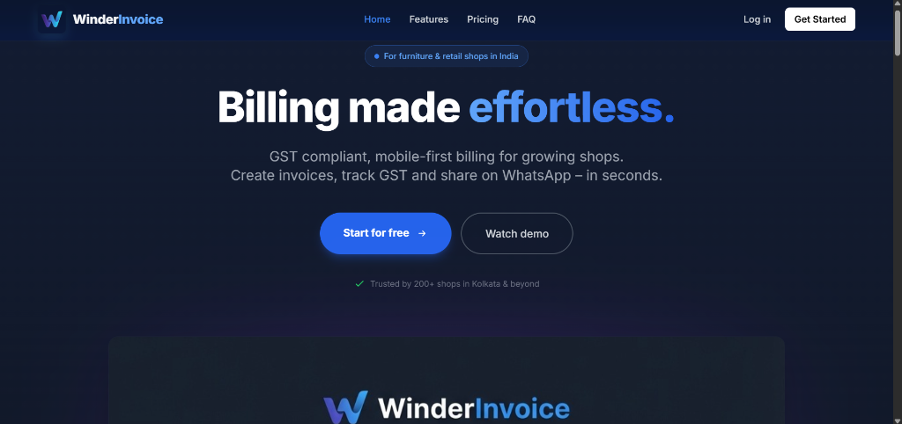
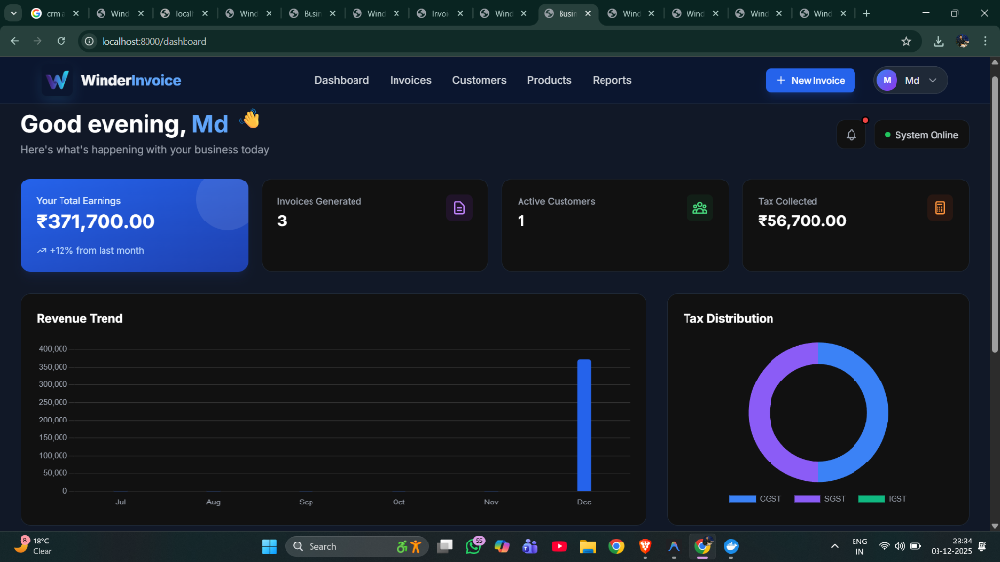

# WinderInvoice



**Billing made effortless.**

A professional, GST-compliant, and mobile-first billing application designed for growing shops and retail businesses in India. Create invoices, track GST, and share on WhatsApp in seconds.

---

## ✨ Why WinderInvoice?

*   **🇮🇳 GST Compliant**: Automatic calculation of CGST, SGST, and IGST based on customer location.
*   **📱 Mobile First**: Fully responsive design that works perfectly on your phone, tablet, or desktop.
*   **⚡ Lightning Fast**: Built with FastAPI for high performance and instant page loads.
*   **🔒 Secure**: Role-based access control and secure data handling.

---

## 🚀 Key Features

### 📊 Powerful Dashboard
Get a real-time overview of your business performance. Track total earnings, invoices generated, active customers, and tax collected at a glance.



### 🧾 Professional Invoicing
*   **Dynamic Tax Calculation**: Handles multiple tax rates (5%, 12%, 18%, 28%) automatically.
*   **PDF Generation**: Generate high-quality, print-ready PDF invoices.
*   **WhatsApp Share**: Share invoices directly with customers via WhatsApp.
*   **Thermal Print Support**: Optimized layouts for thermal printers.

### 👥 Customer & Product Management
*   **Smart Ledger**: Maintain detailed customer records with GSTIN and address details.
*   **Inventory Tracking**: Manage products with HSN codes and stock levels.

### ⚙️ Customizable Settings
*   **Shop Profile**: Update your shop details, logo, and signature.
*   **Bank Details**: Configure bank accounts and UPI QR codes for payments.

---

## 🛠️ Tech Stack

*   **Backend**: Python 3.11+, FastAPI, SQLAlchemy
*   **Frontend**: HTML5, TailwindCSS, Vanilla JS
*   **Database**: PostgreSQL (Production) / SQLite (Dev)
*   **Containerization**: Docker & Docker Compose

---

## 🏁 Quick Start

### Using Docker (Recommended)

1.  **Clone the repository**
    ```bash
    git clone https://github.com/yourusername/winderinvoice.git
    cd winderinvoice
    ```

2.  **Run with Docker Compose**
    ```bash
    docker-compose up -d --build
    ```

3.  **Access the App**
    *   Open `http://localhost:8000`
    *   **Default Login**: `admin@example.com` / `admin123`
    *   **Setup**: Visit `/auth/setup` if running for the first time.

### Manual Installation

1.  Create a virtual environment: `python -m venv venv`
2.  Activate it: `venv\Scripts\activate` (Windows) or `source venv/bin/activate` (Linux/Mac)
3.  Install dependencies: `pip install -r requirements.txt`
4.  Run the server: `uvicorn app.main:app --reload`

---

## 🚢 Deployment

Ready for production? WinderInvoice is cloud-ready.

*   **Railway**: One-click deployment supported.
*   **Docker**: Deploy anywhere Docker runs (AWS, DigitalOcean, Azure).

See [DEPLOYMENT.md](DEPLOYMENT.md) for detailed instructions.

---

## 📝 License

Proprietary software. All rights reserved.

---

<p align="center">
  Built with ❤️ for Indian Businesses
</p>
